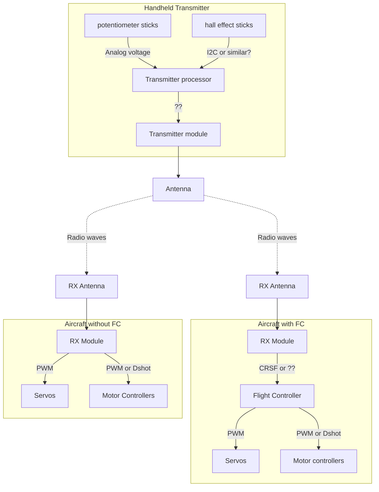

# RC Control

```mermaid
flowchart TB
	subgraph Handheld Transmitter
    A[potentiometer sticks] -- Analog voltage --> C[Transmitter processor]
    B[hall effect sticks] -- I2C or similar? -->C
	  C -- ?? --> D[Transmitter module]
	end

  D --> E[Antenna] -. Radio waves ...-> F1[RX Antenna] --> G1

  E -. Radio waves ...-> F2[RX Antenna] --> G2


  subgraph Aircraft with FC
    G1[RX Module] -- CRSF or ?? --> H1[Flight Controller]
		H1 -- PWM --> J1[Servos]
		H1 -- PWM or Dshot --> I1[Motor controllers]
	end

	subgraph Aircraft without FC
		G2[RX Module] -- PWM --> J2[Servos]
		G2 -- PWM or Dshot --> I2[Motor Controllers]
	end
```
