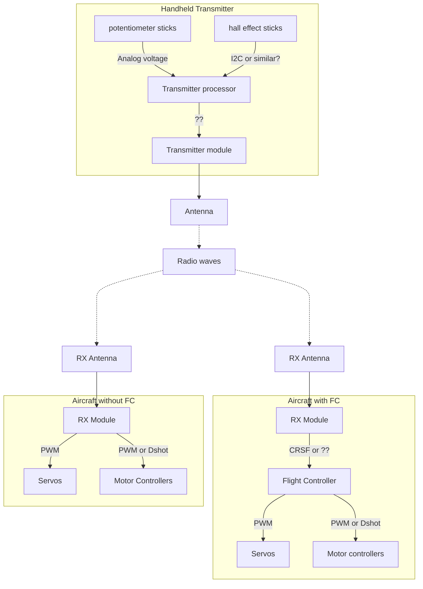

# RC Control

Sapiente est velit iure nam. Enim molestiae ipsam voluptas quia voluptas nesciunt deserunt magni. Doloremque veniam et aliquam voluptatem labore perferendis ab. Possimus eos impedit quaerat tenetur consectetur magnam illum. Voluptas in sequi et officia.

Vitae molestiae quo cum dolorem. Vel et et iste voluptatem. Ipsa non quae et vitae illo natus aspernatur. Quam voluptas ut ut distinctio ut laudantium sequi.

Error voluptas voluptatem vel voluptatem quisquam vero assumenda aut. Consequatur eius odit qui ut. Quas qui eos rerum perferendis. Repudiandae nesciunt et labore voluptas. Et aut sed occaecati dolores.

Id et voluptatem sit necessitatibus magni reiciendis officia. Totam est mollitia aut ad iste ab neque mollitia. Voluptatem impedit magni dolorem voluptatibus sequi id qui eaque.

Reiciendis quo amet consequatur delectus unde aliquid inventore earum. Vitae ipsum repudiandae reprehenderit ut ipsa. Molestiae exercitationem fugit quisquam.

## Radio

Target
